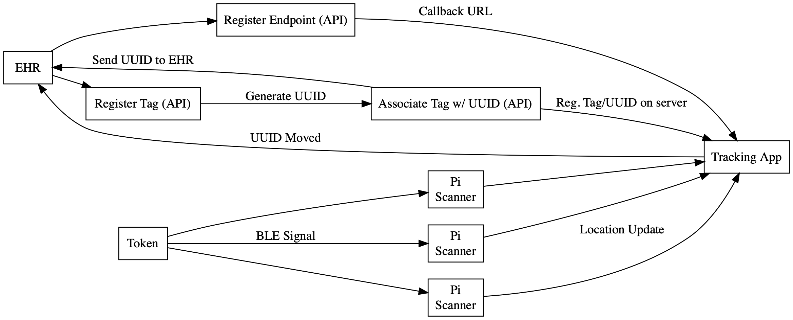

# Real-Time Bluetooth Low Energy Patient Tracking System

This is a project I completed as a part of my time as a Development Intern at Medical Informatics Engineering.

## The Problem

Currently, healthcare workers have to manually update location of patients in a EHR (Electronic Health System). The implementation of EHR's have led to more human–computer interaction, which in some cases can take excessive time. The more time that is spent interacting with an EHR interface causes less efficient healthcare.

From [The Impact of a Location-Sensing Electronic Health Record on Clinician Efficiency and Accuracy: A Pilot Simulation Study](https://www.ncbi.nlm.nih.gov/pmc/articles/PMC6249134/#:~:text=Conclusion%20This%20pilot%20demonstrated%20in,clicks%20required%20to%20access%20information.):

“While EHRs have been represented to place patient information . . . at the fingertips of clinicians, physicians continue to struggle to efficiently and safely use these systems.”

From Study:
Average time required to locate patients with RTLS (Real-Time Location Services)  = 11.9 ± 2.0 seconds vs. Without = 36.0 ± 5.7 seconds, 
Average rooms searched to find patient with RTLS = 1.0 ± 1.06 vs. Without = 3.8 ± 0.5

“This study suggests EHRs equipped with real-time location services that automates patient location and other repetitive tasks may improve physician efficiency, and ultimately, patient safety.”

King K, Quarles J, Ravi V, Chowdhury TI, Friday D, Sisson C, Feng Y. The Impact of a Location-Sensing Electronic Health Record on Clinician Efficiency and Accuracy: A Pilot Simulation Study. Appl Clin Inform. 2018 Oct;9(4):841-848. doi: 10.1055/s-0038-1675812. Epub 2018 Nov 21. PMID: 30463095; PMCID: PMC6249134.

## Design

BLE (Bluetooth Low Energy) tokens (iBeacons) send advertisements to scanners. The scanners then send the updates to the controller web application, which updates the database. The Web Application is created with [Meteor](https://www.meteor.com), a full stack JavaScript framework with built a built in MongoDB database and real-time updates.

The recievers can be any computer with BLE and networking capabilities (in my case, raspberry pi 4s). These recievers are placed around a healthcare clinic and update the database remotely. 

An API is included in this project that allows an EHR (or any system) to securely register and communicate with the app. An EHR can use the API to register it's endpoint for patient updates. Additionally, it can register tags; the API will generate a UUID for the tag to pass back to the EHR to associate updates with. When a BLE token moves, the Web Application will send a notification to the EHR endpoint that the UUID moved. This will allow secure transfer of information.

> [!NOTE]
> The distance calculations in this system are based a iBeacon RSSI strength. 
> These readings are usually extremely "jumpy" and not reliable for close estimations. To combat this, rigorous testing and variable tinkering is needed.
> Scanners should be placed strategically and far from eachother so they can have large detection ranges without overlapping.

# Usage

Video Demonstration of Web Application and API.

## Components

The System is designed with three main components:

### Web Application

This is a Meteor.js full-stack web application that runs a MongoDB database to handle incoming location changes.
The app utilizes React and Bootstrap for UI.

The app and its documentation is located in the "app-backend" directory.

#### Stack:

JavaScript  
[Meteor](https://www.meteor.com)  
[Node.js](https://nodejs.org/en)  
[React](https://react.dev)  
[React Bootstrap](https://react-bootstrap.netlify.app)  
HTML/CSS

### Bluetooth Low Energy Scanning

The system utlizies computer boards to scan for BLE beacons and send location updates to the app. These could be any board with BLE and networking capabilities.

The scanning is handled by Node.js programs. The code and its documentation can be found in the "BLE" directory.

#### Stack:

JavaScript  
[Node.js](https://nodejs.org/en)

### API

The API is used to register EHR endpoints and tags with the App.
It assigns UUIDs to tags, so that the app can securely update the location of a patient without knowing their name.

The API is build with Node.js utilizing Express.js.

The API and its documentation can be found in the "UUID-API" directory.

#### Stack:

JavaScript  
[Node.js](https://nodejs.org/en)  
[Express.js](https://expressjs.com)

