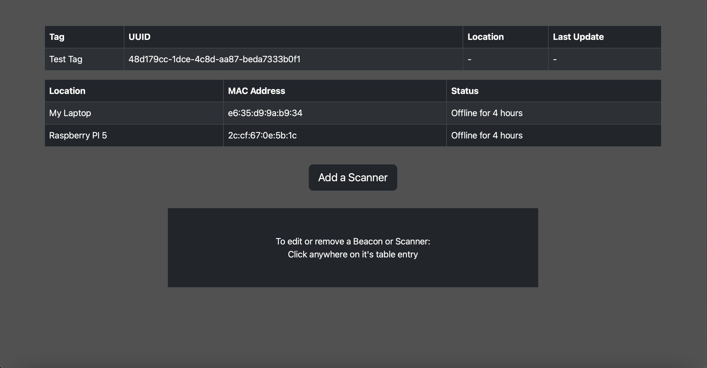
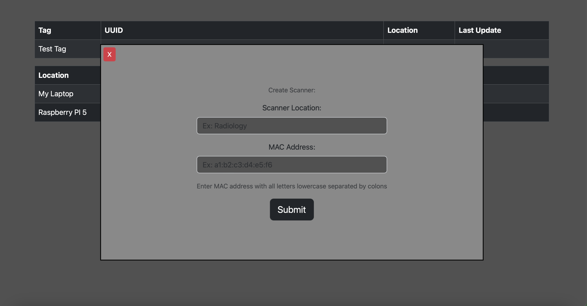
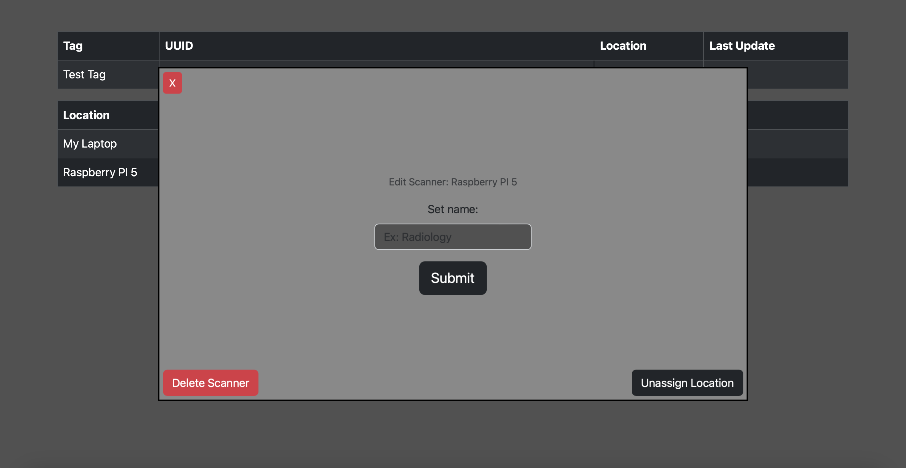
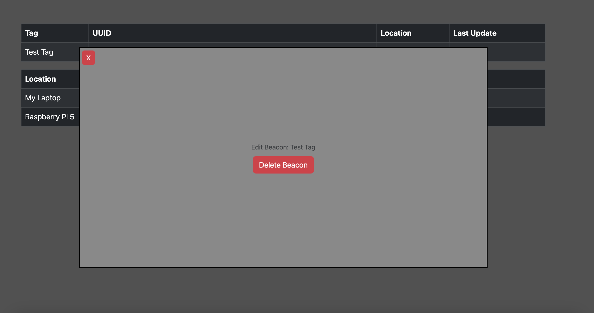

# Web Application

## Installation & Set Up

This project runs the recently released Meteor 3.0

Navigate into the Meteor project (app-backend).
If you do not currently have Meteor 3.0 installed, run this command to install Meteor on Windows, Linux and OS X.

```bash
npx meteor
```

> [!NOTE]
> You may need to prefix this command with "sudo" for correct installation on some distributions.

If you have errors installing Meteor 3.0, please refer to the [Meteor Installation Guide](https://v3-docs.meteor.com/about/install.html)

Then, you can install dependencies by running the following commands: 

```bash
meteor npm install
```

To start the app, simply run the following command: 
```bash
meteor
```
You can access the web application at http://localhost:3000 in the browser by default

> [!NOTE]
> Meteor's default ports are 3000 and 3001 for the web application and MongoDB database, respectively. To change this when booting the app up, you can run:
> ```bash
> meteor --port ####
> ```
> Keep in mind that meteor will use the specified port + 1 to run the built-in MongoDB database on.
>
> e.g.
> ```bash
> meteor --port 5000
> ```
> will run the web application on port 5000 and the MongoDB database on port 5001

## Usage

### Dashboard



The dashboard displays the current tokens and scanners that are registered in the system. The tokens are accompanied by their current location and last update. 
The scanners show their current status.

### Creating a Scanner

Below the tables, there is a button labeled "Add Scanner" (refer to the dashboard image above).
Clicking this button will reveal a panel to create a scanner.



Entering a Name for the location of the scanner as well as it's MAC address will add it the systems configuration instantly.

### Editing a Scanner

Clicking on any Scanner's table entry will reveal a panel that allows the user to edit the scanner.



This panel offers three features:

- The main input field allows the name of the scanner to be changed.

- A red "Delete Scanner" button allows the user to delete the scanner from the system.

- A dark "Unassign Location" button simply renames the scanner's location to a placeholder.

### Edit BLE Tag

Clicking on any tag's table entry will reveal a panel that allows the user to edit the tag.



This panel only offers one feature:

- A red "Delete Scanner" button allows the user to delete the tag from the system.

### Creating Tags w/ API

The creation of tags and uuid generation are completely handled by the API for security purposes. 
The API and instructions on how to perform these procedures are found in the "UUID-API" folder.

